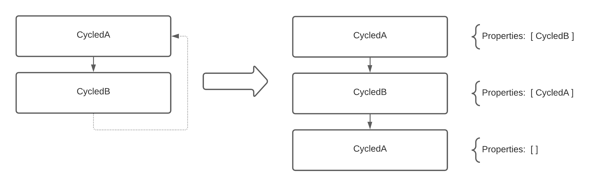

# Tree Parser

This is GASTree parser. 

It convert `GAST` to `Code Generator Models` but, even more, it resolve references and embed refrenced components in components which contains references.

## How does it works

There is a main entry point - `TreeParser` swift structure. It takes an array of `DependencyWithTree` swift structures and then the magic will start.

`TreeParser` can parse all elements of OpenAPI. It contains parsers for each components. And each subparser contains its own subparser for more specific OpenAPI elements.

## Resolver

The most interesting part is `Reference Resolving` and `Resolver` deal with it.

In terms of this class there are some definitions:
- `Local reference` - `$ref` which hasn't a path to file. For example this is reference is local --> `$ref: #/components/schemas/Object`
- `Global reference` - `$ref` which has a path. For example --> `$ref: "../../other/path/specification.yaml#/components/schemas/Object"`

> If you want more information about global references - you should look at `PathNormalizerTests.swift`

This class do:
1. Determine what type reference is - `local` or `global`
2. If reference is `local` then `resolver` will just call `resolve` for current `GAST` -- so it just search for referenced object in this tree
3. If reference is `global`
    1. Search for the tree which is referenced. For example if we have `$ref: "../models.yaml#/components/schemas/Object"` which is declared in file at path `/user/repo/project/swagger/controllers/catalog/api.yaml`. And while parsing this file we find the `$ref`. And it means that we need to search for the `GAST` tree which has the same file path (we have all GAST with their paths in `DependencyWithTree` array). So now we have GAST which is located in `/user/repo/project/swagger/controllers/models.yaml` (because of `../` in `$ref`) or we have an error and the process will be terminated (:
    2. After we get the specific tree we will make step `2` but especially for this tree.
4. Then we check if resolved component has nested references (like when we has ref on Object which has property whose type is `$ref`...)
5. If it has, we will continue from step `1`
6. If it hasn't, we stop resolving

**About refrence cycles**

This the case:

```YAML
schemas:
    CycledA:
      type: object
      properties:
        cycle:
          $ref: "#/components/schemas/CycledB"

    CycledB:
      type: object
      properties:
        cycle:
          $ref: "#/components/schemas/CycledA"
```

Or: 

```YAML
schemas:
    Category:
      type: object
      properties:
        subcategories:
          type: array
          items:
            $ref: "#/components/schemas/Category"
```

`Resolver` keeps track of resolved objects.
Resolved object is a structure describing reference and short model of object, which was found with this reference:
```YAML
ResolvedRef:
  ref:
    pathToFile: "models.yaml"
    refValue: "#/components/schemas/CycledA"
  objectNode:
    name: "CycledA"
```

For example, in first case it will add `CycledA`, then `CycledB`.
On the next iteration `Resolver` will see that reference `"#/components/schemas/CycledA"` is already in list of resolved objects.
So instead of trying to resolve reference `"#/components/schemas/CycledA"` it will take already saved model from list.


